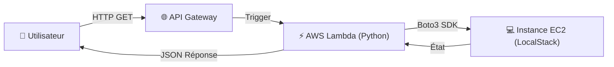

C'est parti ! Voici le fichier **`README.md`** complet, corrigé et prêt à l'emploi.

Il intègre le diagramme corrigé, les étapes de vérification précises (Stop & Start) et la syntaxe Markdown parfaite pour que tout s'affiche bien sur GitHub.

Copie **intégralement** le bloc ci-dessous :

```markdown
# ☁️ API-Driven Infrastructure (LocalStack Edition)

> **Projet :** Pilotage dynamique d'une infrastructure AWS simulée via API REST.
> **Concept :** "Zero Console" - Tout est contrôlé par le code et les requêtes HTTP.

Ce projet démontre comment orchestrer des ressources Cloud (EC2) sans jamais toucher à une console graphique. L'architecture repose sur **API Gateway** et **Lambda** pour piloter une instance **EC2** au sein d'un environnement **LocalStack** (émulateur AWS).

---

## 🏗️ Architecture Technique

Le flux de données est le suivant :



* **API Gateway** : Expose les endpoints publics (`/start`, `/stop`, `/status`).
* **AWS Lambda** : "Cerveau" du projet. Reçoit l'ordre, interagit avec l'EC2 et renvoie une réponse JSON formatée (UTF-8).
* **EC2** : La ressource d'infrastructure cible (Machine Virtuelle simulée).

---

## 🚀 Installation & Démarrage (Automatisé)

Ce projet utilise un **Makefile** pour automatiser l'installation des dépendances, le démarrage du moteur Cloud et le déploiement de l'infra.

### Pré-requis

* GitHub Codespaces (Recommandé) ou Linux avec Python 3.

### 1. Installation & Démarrage

Lancez les commandes suivantes pour préparer l'environnement :

```bash
make install   # Crée le venv et installe LocalStack/AWS CLI
make start     # Démarre le moteur AWS en arrière-plan

```

### ⚠️ ÉTAPE CRITIQUE : Exposition du Port

Avant de continuer, vous **devez** rendre l'API accessible :

1. Allez dans l'onglet **[PORTS]** de VS Code.
2. Repérez le port **4566**.
3. Faites **Clic-droit > Visibilité du port > Public**.

> *Sans cette action, les URLs générées ne seront pas accessibles depuis votre navigateur.*

### 2. Déploiement de l'Infrastructure

Une fois le port ouvert, lancez le script de déploiement "Ultimate" :

```bash
make deploy

```

Ce script va automatiquement :

* Detecter votre URL Codespace.
* Lancer une instance EC2.
* Configurer la sécurité (IAM).
* Déployer le code Lambda et l'API Gateway.
* **Vous afficher les liens de contrôle cliquables.**

---

## 🎮 Utilisation de l'API

L'API répond en JSON formaté avec des émojis pour indiquer l'état visuellement.

| Méthode | Endpoint | Action | Réponse attendue (Exemple) |
| --- | --- | --- | --- |
| **GET** | `/status` | Vérifie l'état de la VM | `{"etat_actuel": "running", "message_info": "🔍 Vérification..."}` |
| **GET** | `/stop` | Éteint la VM | `{"etat_actuel": "stopped", "message_info": "🛑 Arrêt demandé..."}` |
| **GET** | `/start` | Allume la VM | `{"etat_actuel": "pending", "message_info": "🚀 Démarrage initié..."}` |

---

## 🧪 Vérification Technique (Preuve de concept)

Comment être sûr que l'API pilote vraiment l'infrastructure ? Nous allons comparer l'action Web avec l'état réel du serveur AWS.

**Commande de vérification (à lancer dans le terminal) :**

> Cette commande interroge directement AWS pour connaître l'état de la machine.

```bash
./rep_localstack/bin/awslocal ec2 describe-instances --query 'Reservations[0].Instances[0].State.Name' --output text

```

### 🛑 Test 1 : Arrêt de la machine

1. Cliquez sur le lien **STOP** dans votre navigateur.
2. Exécutez la commande de vérification ci-dessus dans le terminal.
3. **Résultat :** Le terminal doit afficher `stopped`.

### 🚀 Test 2 : Démarrage (L'inverse)

1. Cliquez sur le lien **START** dans votre navigateur.
2. Attendez environ **5 secondes** (le temps du démarrage simulé).
3. Relancez la même commande de vérification.
4. **Résultat :** Le terminal doit afficher `running`.

> **Conclusion :** Ces tests prouvent que votre interface Web (Front-end) pilote avec succès et en temps réel le moteur AWS (Back-end).

---

## 🛠️ Commandes Utiles (Makefile)

Un **Makefile** est inclus pour automatiser toutes les tâches répétitives.

| Commande | Description |
| --- | --- |
| `make install` | 📦 **Installation :** Crée l'environnement virtuel et installe LocalStack & AWS CLI. |
| `make start` | 🚀 **Démarrage :** Lance le moteur LocalStack en arrière-plan. |
| `make deploy` | 🏗️ **Déploiement :** Lance le script `setup.sh` (Infra + API + Lambda). |
| `make stop` | 🛑 **Arrêt :** Stoppe les conteneurs et services LocalStack. |
| `make clean` | 🧹 **Nettoyage :** Supprime l'environnement virtuel et les fichiers temporaires (Idéal pour repartir de zéro). |

---

*Réalisé dans le cadre du TP API-Driven Infrastructure.*

```

```